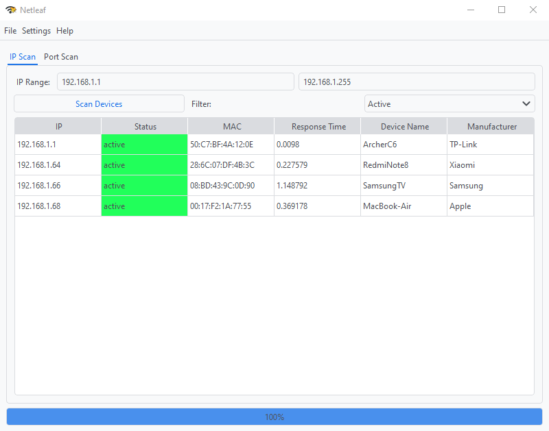

# Netleaf - Network Scanner

Netleaf is a simple and user-friendly network scanning tool built with Python and PySide6. It provides both IP and port scanning capabilities with a clean and intuitive graphical user interface.

## Features

- **IP Range Scanning:** Scan a range of IP addresses to detect active devices.
- **Port Scanning:** Quickly scan for open ports on target devices.
- **Device Information:** Displays Device Name and Manufacturer lookup.
- **Dark and Light Theme Support:** Choose between dark and light themes.
- **Customizable Scanning Settings:** Configure scan attempts, protocols (ARP, ICMP, TCP, UDP), timeouts, and more.
- **Results Filtering:** Easily filter devices by status (All, Active, Timeout, Inactive).
- **CSV Export:** Export scan results to CSV for further analysis.
- **Multi-threaded Scanning:** Improved scanning speed with multi-threading support.

## Installation

Netleaf provides installers for multiple platforms:

- **Windows:** `NetleafSetup.exe`
- **Linux (Debian/Ubuntu):** `.deb` package
- **Linux (Fedora/openSUSE/RHEL):** `.rpm` package

1. Go to the [Releases](https://github.com/Niamorro/Netleaf/releases) page.
2. Download the installer/package for your operating system.
3. Install and follow any on-screen or system instructions.

## Usage

### IP Scanning

1. Enter the IP range to scan.
2. Click **Scan Devices** to start the IP scan.
3. View results in the table which includes Device Name and Manufacturer.
4. Use the filter dropdown to filter results by device status.

### Port Scanning

1. Switch to the **Port Scan** tab.
2. Enter the IP address and port range to scan.
3. Click **Scan Ports** to start the port scan.
4. View results in the table.

### Configuration

Customize various settings through the **Settings** menu:

- **Appearance:** Choose between light and dark themes.
- **Logging:** Enable or disable logging.
- **Scanning:** Configure scan attempts, protocols, timeouts, and more.

### Exporting Results

Use the **Save to File** option in the **File** menu to export scan results as a CSV file.

## Main Window

## License

This project is licensed under the GNU General Public License v3.0 – see the [LICENSE](LICENSE) file for details.
